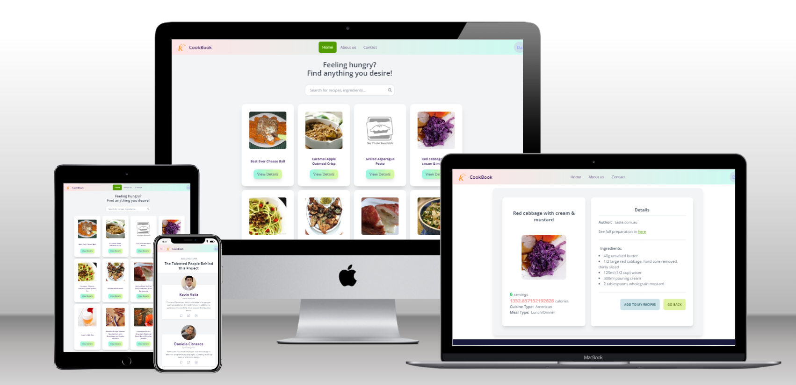

<div align="center">


<h1>Cook Book App</h1>

   

Busca, crea y guarda todas tus recetas en un solo lugar!

[View Demo](https://cookbook-kv-dc.vercel.app) | [Video](https://youtu.be/MKoJPXldkPA) | [Wireframe in Figma](https://www.figma.com/file/cHM2qY3UV7a6UgPYdqTjDA/Untitled?node-id=0%3A1&t=gpLIX2ZGd57g5eft-0)
</div>

## 🌟 About this project

En esta aplicación podrás buscar recetas de distintos autores y con distintos ingredientes.
Además, podrás almacenar tus propias recetas y armar una colección virtual con todas ellas.

 

## 🛠 Built with

- HTML
- CSS
- JavaScript
- React.js
- Redux Toolkit
- Axios
- Firebase
- Tailwind CSS
- Vercel


## 👀 Prerequisites

Es necesario tener Git y Node.js instalado en tu computadora antes de instalar este proyecto.

## 🏃 Run Locally

Clonar el repositorio

```bash
  git clone https://github.com/DaniCis/Recipes_Kruger
```

Ir al directorio del proyecto

```bash
  cd my-project
```

Instalar todas las dependencias

```bash
  npm install
```

Iniciar el servidor

```bash
  npm run start
```
Por defecto la aplicación se ejecutará en tu navegador en https://localhost:3000

## 🧪 Running Tests

Para ejecutar las pruebas de la aplicación, utilizar el siguiente comando

```bash
  npm run test
```


## 📜 API Reference

Para este proyecto se utilizó una  [API gratuita](https://developer.edamam.com/recipe-demo) para buscar recetas de cocina.

#### Obtener todas las recetas

```http
  GET /api/recipes/v2
```

| Parámetro | Tipo     | Descripción                |
| :-------- | :------- | :------------------------- |
| `api_key` | `string` | **Requerido**. Tu propia API key |

#### Obtener la información de una receta en específico

```http
  GET /api/rcipes/v2/${id}
```

| Parámetro | Tipo     | Descripción                       |
| :-------- | :------- | :-------------------------------- |
| `id`      | `string` | **Requerido**. Id de la receta a obtener|

Documentación completa de la API [aquí](https://developer.edamam.com/edamam-docs-recipe-api)

## 🔑 Environment Variables

Para correr este proyecto, es necesario añadir las siguientes variables de entorno a tu archivo .env con la información que te provea la API 

`REACT_APP_KEY` 

`REACT_API_ID` 

`REACT_API_URL` 

## Authors

👤 **Daniela Cisneros**

- GitHub: [@DaniCis](https://github.com/DaniCis)
- Twitter: [@DaniCisneros99](https://twitter.com/DaniCisneros99)

👤 **Kevin Veliz**
- Github: [@KevinVeliz](https://github.com/KevinVeliz)
- LinkedIn: [KevinVeliz](https://www.linkedin.com/in/kevin-veliz-b747a0206/)

## 💎 Acknowledgements

- [Sweet Alert 2](https://sweetalert2.github.io/)
- [Recipe Search Api](https://developer.edamam.com/recipe-demo)
- [Daisy UI](https://daisyui.com/)

## 🤝 Contributing

[Juan Sotomayor](https://github.com/Juanse7793) - Tutor Frontend Kruger Star

## Show your support

Deja una ⭐ si te ha gustado este proyecto!
